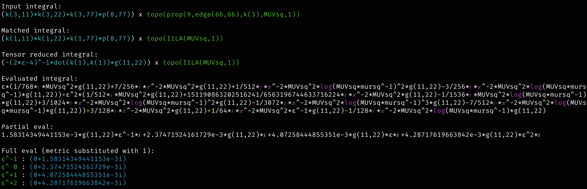

# vakint

Library for the computation of (single-scale) vacuum integrals in High Energy Physics.

The code will perform the matching of user input onto known topologies, and then perform their computation either:

* analytically, if the topology is known, using tensor reduction and parametric integration by parts.
To this end, it uses a combination of `Symbolica` and `FORM` scripts, and `FMFT` for the four-loop case.

* numerically, if the topology is not known, using the sector decomposition algorithm implemented in `pySecDec`.

## Usage

Checkout the examples directory for a few examples of how to use this library.
For example:

```rust
use symbolica::atom::Atom;
use vakint::{Vakint, VakintExpression, VakintSettings};

fn main() {
    let vakint = Vakint::new(Some(VakintSettings {
        allow_unknown_integrals: false,
        ..VakintSettings::default()
    }))
    .unwrap();

    //println!("Supported topologies:\n{}", vakint.topologies);

    let input = Atom::parse(
        "(k(11,2)*k(11,2)+k(11,77)*k(22,77)+k(22,33)*p(42,33))*topo(\
                    prop(9,edge(7,10),k(11),mUVsqA,1)*\
                    prop(33,edge(7,10),k(22),mUVsqA,2)*\
                    prop(55,edge(7,10),k(11)+k(22),mUVsqA,1)\
                )+\
                (2*k(33,2)*k(33,2)+17*k(44,33)*p(17,33))*topo(\
                    prop(7,edge(9,21),k(33),mUVsqB,1)*\
                    prop(13,edge(9,21),k(44),mUVsqB,2)*\
                    prop(17,edge(9,21),k(33)+k(44),mUVsqB,1)\
                )",
    )
    .unwrap();

    let output = vakint.to_canonical(input.as_view(), true).unwrap();

    println!(
        "\nInput:\n\n{}\n\nhas been matched to\n\n{}\n",
        VakintExpression::try_from(input).unwrap(),
        VakintExpression::try_from(output).unwrap()
    );
}
```

yields:


When carrying a complete evaluation, the workflow is as follows:

```rust
use ahash::HashMap;
use symbolica::atom::Atom;
use vakint::{Vakint, VakintExpression, VakintSettings};

fn main() {
    let vakint = Vakint::new(Some(VakintSettings {
        allow_unknown_integrals: false,
        use_dot_product_notation: true,
        integral_normalization: "1".into(),
        n_digits_at_evaluation_time: 16,
        ..VakintSettings::default()
    }))
    .unwrap();

    let mut integral = Atom::parse(
        "(k(3,11)*k(3,22)+k(3,77)*p(8,77))*topo(\
        prop(9,edge(66,66),k(3),MUVsq,1)\
    )",
    )
    .unwrap();
    println!(
        "\nInput integral:\n{}\n",
        VakintExpression::try_from(integral.clone()).unwrap()
    );

    integral = vakint.to_canonical(integral.as_view(), true).unwrap();
    println!(
        "Matched integral:\n{}\n",
        VakintExpression::try_from(integral.clone()).unwrap()
    );

    integral = vakint.tensor_reduce(integral.as_view()).unwrap();
    println!(
        "Tensor reduced integral:\n{}\n",
        VakintExpression::try_from(integral.clone()).unwrap()
    );

    integral = vakint.evaluate_integral(integral.as_view()).unwrap();
    println!("Evaluated integral:\n{}\n", integral);

    let mut params = HashMap::default();
    params.insert("MUVsq".into(), 1.0);
    params.insert("mursq".into(), 1.0);

    let numerical_partial_eval = vakint.partial_numerical_evaluation(integral.as_view(), &params);
    println!("Partial eval:\n{}\n", numerical_partial_eval);

    params.insert("g(11,22)".into(), 1.0);
    let numerical_full_eval = vakint
        .full_numerical_evaluation(integral.as_view(), &params)
        .unwrap();
    println!(
        "Full eval (metric substituted with 1):\n{}\n",
        numerical_full_eval
    );
}
```

yielding:

